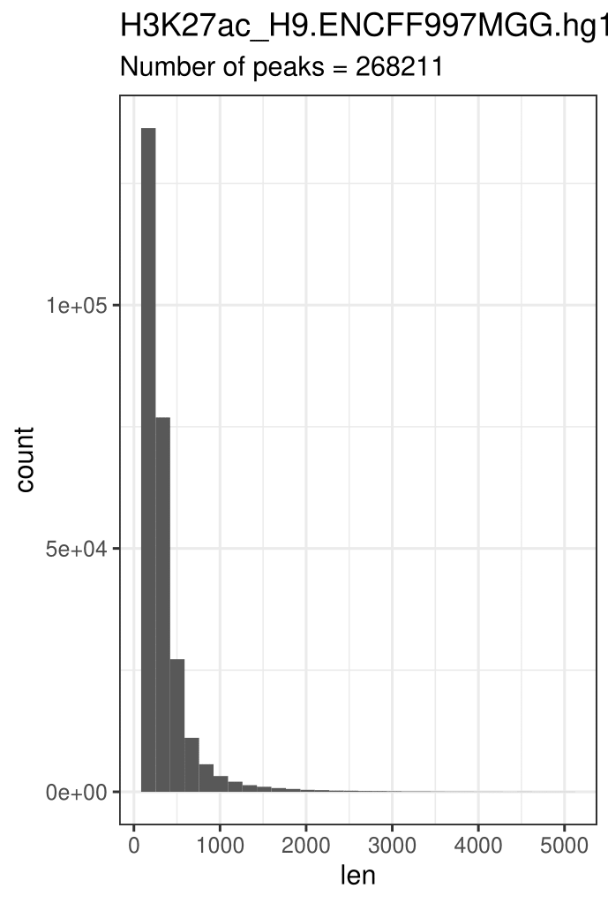

# hse21_H3K27ac_ZDNA_human
# Проект по майнору "Биоинформатика", ВШЭ 2021
## Никитенко Яна, 3 группа

### Исходные данные

| Организм | Гистоновая метка | Тип клеток | Метка 1 | Метка 2 | Структура ДНК |
| -------- | ------------- | ---------------- | ---------- | ------- | ------- |
| Human (hg19) | H3K27ac | H9  | [ENCFF997MGG](https://www.encodeproject.org/files/ENCFF997MGG/) | [ENCFF365GJO](https://www.encodeproject.org/files/ENCFF365GJO/) | ZDNA_DeepZ|


### Анализ пиков гистоновой метки
Для работы необходимо скачать два .bed файла ChIP-seq экспериментов из ENCODE (пики гистоновой метки). Для анализа достаточно рассмотреть первых пять столбцов.
```
yavnikitenko@laboratory01:~/project/bed_files$ wget https://www.encodeproject.org/files/ENCFF365GJO/@@download/ENCFF365GJO.bed.gz
yavnikitenko@laboratory01:~/project/bed_files$ wget https://www.encodeproject.org/files/ENCFF997MGG/@@download/ENCFF997MGG.bed.gz

yavnikitenko@laboratory01:~/project/bed_files$  zcat ENCFF365GJO.bed.gz  |  cut -f1-5 > H3K27ac_H9.ENCFF365GJO.hg38.bed
yavnikitenko@laboratory01:~/project/bed_files$  zcat ENCFF997MGG.bed.gz  |  cut -f1-5 > H3K27ac_H9.ENCFF997MGG.hg38.bed
```
Анализ проводится для версии генома hg19, поэтому необходимо конвертировать разметку данных. Для этого воспользуемся утилитой liftOver. 
Скачиваем файл для перевода hg38 в hg19 и запускаем конвертацию для каждой метки.
```
yavnikitenko@laboratory01:~/project/bed_files$ wget https://hgdownload.cse.ucsc.edu/goldenpath/hg38/liftOver/hg38ToHg19.over.chain.gz
yavnikitenko@laboratory01:~/project/bed_files$ liftOver   H3K27ac_H9.ENCFF365GJO.hg38.bed   hg38ToHg19.over.chain.gz   H3K27ac_H9.ENCFF365GJO.hg19.bed   H3K27ac_H9.ENCFF365GJO.unmapped.bed
yavnikitenko@laboratory01:~/project/bed_files$ liftOver   H3K27ac_H9.ENCFF997MGG.hg38.bed   hg38ToHg19.over.chain.gz   H3K27ac_H9.ENCFF997MGG.hg19.bed   H3K27ac_H9.ENCFF997MGG.unmapped.bed
```
После конвертации можно заметить, что кол-во пиков изменилось. Быстрый способ заметить изменения - посчитать кол-во строк в файлах.
```
yavnikitenko@laboratory01:~/project/bed_files$ wc -l *
```
>   22160 ENCFF365GJO.bed.gz<br/>
>   27283 ENCFF997MGG.bed.gz<br/>
>  226956 H3K27ac_H9.ENCFF365GJO.hg19.bed<br/>
>  227245 H3K27ac_H9.ENCFF365GJO.hg38.bed<br/>
>     578 H3K27ac_H9.ENCFF365GJO.unmapped.bed<br/>
>  268254 H3K27ac_H9.ENCFF997MGG.hg19.bed<br/>
>  268678 H3K27ac_H9.ENCFF997MGG.hg38.bed<br/>
>     848 H3K27ac_H9.ENCFF997MGG.unmapped.bed<br/>
>    4753 hg38ToHg19.over.chain.gz<br/>
> 1046755 total<br/>

##### Построение гистограмм длин участков
Строим гистограмму длин участков для каждого эксперимента до и после конвертации к нужной версии генома. ([скрипт](src/len_hist.R))

Результаты **ENCFF365GJO** hg38 и hg19:<br/>


Результаты **ENCFF997MGG** hg38 и hg19:<br/>


##### Фильтрация пиков
Проведя анализ, приведенных выше гистограм, можно сделать вывод о слишком длинных пиках, которые резко выбиваются из всего набора. 
Установим порог в 5000 и отфильтруем данные. ([скрипт](/src/rm_outliers.R))

Результаты:<br/>
**ENCFF365GJO**<br/>

**ENCFF997MGG**<br/>


- Можно заметить, что кол-во пиков изменилось незначитильно, но на гистограммах не заметны выделяющиеся по длине пики.

##### Расположение пиков

С помощью [скрипта](src/ChipSeeker.R) на R были построены графики расположения пиков гистоновых меток относительно аннотированных генов. 

Результаты:

###### chip_seeker.ENCFF697NMG.hg19.filtered.plotAnnoPie

###### chip_seeker.ENCFF587TWB.hg19.filtered.plotAnnoPie


##### Объединение файлов

Отсортированные файлы были загружены на кластер, отсортированы и объединены с помощью bedtools:

```bash
 cat  *.filtered.bed  |   sort -k1,1 -k2,2n   |   bedtools merge   >  H3K9me3_H1.merge.hg19.bed
```

Затем с помощью winSCP полученный файл был перенесен на ПК для дальнейшей работы.

##### Визуализация

Сохраненная сессия в UCSC GenomeBrowser: http://genome.ucsc.edu/s/mausenkova/hse21_H3K9me3_G4_human

С помощью [Genome Browser](http://genome.ucsc.edu/s/mausenkova/hse21_H3K9me3_human) были визуализированы полученные исходные наборы ChIP-seq пиков и их объединение:

```
track visibility=dense name="ENCFF587TWB"  description="H3K9me3_H1.ENCFF587TWB.hg19.filtered.bed"

track visibility=dense name="ENCFF697NMG"  description="H3K9me3_H1.ENCFF697NMG.hg19.filtered.bed"

track visibility=dense name="ChIP_merge"  color=50,50,200   description="H3K9me3_H1.merge.hg19.bed"

```


Объединение покрывает все наборы.

#### Анализ участков вторичной структуры ДНК

На кластер были скачены архивы с .bed-файлами с данными вторичной структуры ДНК:

```bash
wget https://ftp.ncbi.nlm.nih.gov/geo/samples/GSM3003nnn/GSM3003539/suppl/GSM3003539_Homo_all_w15_th-1_minus.hits.max.K.w50.25.bed.gz

wget https://ftp.ncbi.nlm.nih.gov/geo/samples/GSM3003nnn/GSM3003539/suppl/GSM3003539_Homo_all_w15_th-1_plus.hits.max.K.w50.25.bed.gz
```

Распаковываем и удаляем не нужные для работы столбцы. Объединены в один файл с помощью bedtools:

```bash
zcat GSM3003539_Homo_all_w15_th-1_minus.hits.max.K.w50.25.bed.gz | cut -f1-5 > GSM3003539_minus.bed
zcat GSM3003539_Homo_all_w15_th-1_plus.hits.max.K.w50.25.bed.gz | cut -f1-5 > GSM3003539_plus.bed

cat GSM3003539_*.bed | sort -k1,1 -k2,2n | bedtools merge > GSM3003539.merged.bed 
```
Полученный файл с помощью программы WinSCP были перенесены на ПК для дальнейшей работы.

Далее с помощью [скрипта](src/len_hist.R) на R была получена гистограмма длин участков. 
Результаты:


Также с помощью [скрипта](src/ChipSeeker.R) на R был построен график расположения пиков относительно аннотированных генов.

Результаты:
###### chip_seeker.GSM3003539.merged.plotAnnoPie


#### Анализ пересечений гистоновой метки и структуры ДНК

С помощью bedtools были найдены пересечения гистоновой метки со структурами ДНК:
```bash
bedtools intersect  -a GSM3003539.merged.bed   -b  H3K9me3_H1.merge.hg19.bed  >  H3K9me3_H1.intersect_with_G4.bed
```

Полученный файл с помощью программы WinSCP были перенесены на ПК для дальнейшей работы.

Далее с помощью [скрипта](src/len_hist.R) на R была получена гистограмма длин участков. 
Результаты:


Также с помощью [скрипта](src/ChipSeeker.R) на R был построен график расположения пиков относительно аннотированных генов.

Результаты:
###### chip_seeker.H3K9me3_H1.intersect_with_G4.plotAnnoPie


С помощью [Genome Browser](http://genome.ucsc.edu/s/mausenkova/hse21_H3K9me3_G4_human) были визуализированы полученные участки:

```
track visibility=dense name="ENCFF587TWB"  description="H3K9me3_H1.ENCFF587TWB.hg19.filtered.bed"

track visibility=dense name="ENCFF697NMG"  description="H3K9me3_H1.ENCFF697NMG.hg19.filtered.bed"

track visibility=dense name="ChIP_merge"  color=50,50,200   description="H3K9me3_H1.merge.hg19.bed"

track visibility=dense name="G4"  color=0,200,0  description="G4_Li_K"

track visibility=dense name="intersect_with_G4"  color=200,0,0  description="H3K9me3_H1.intersect_with_G4.bed"

```

Скриншот иллюстрирует пересечения между гистоновой меткой и структурой ДНК:


Например:

| Позиция | Координаты |
| ------- | ---------- |
| 1 | chr1:13790959-13791063 |
| 2 | chr1:13791788-13791843 |

Далее с помощью [скрипта](src/ChIPpeakAnno.R) на R полученные пересечения были ассоциированы с ближайшими генами. Было проассоциировано 490 пиков, 354 уникальных гена.

С помощью [Panther](http://pantherdb.org/) был проведён GO-анализ для полученных уникальных генов. В [файле](data/pantherdb_GO_analysis.txt) представлен результат анализа. 
Далее приведены значимые категории(c минимальными значениями FDR):


