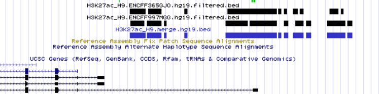
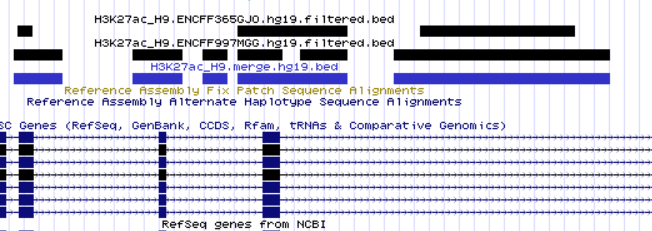

# hse21_H3K27ac_ZDNA_human
# Проект по майнору "Биоинформатика", ВШЭ 2021
## Никитенко Яна, 3 группа

### Исходные данные

| Организм | Гистоновая метка | Тип клеток | Метка 1 | Метка 2 | Структура ДНК |
| -------- | ------------- | ---------------- | ---------- | ------- | ------- |
| Human (hg19) | H3K27ac | H9  | [ENCFF997MGG](https://www.encodeproject.org/files/ENCFF997MGG/) | [ENCFF365GJO](https://www.encodeproject.org/files/ENCFF365GJO/) | ZDNA_DeepZ|


### Анализ пиков гистоновой метки
Для работы необходимо скачать два .bed файла ChIP-seq экспериментов из ENCODE (пики гистоновой метки). Для анализа достаточно рассмотреть первых пять столбцов.
```
yavnikitenko@laboratory01:~/project/bed_files$ wget https://www.encodeproject.org/files/ENCFF365GJO/@@download/ENCFF365GJO.bed.gz
yavnikitenko@laboratory01:~/project/bed_files$ wget https://www.encodeproject.org/files/ENCFF997MGG/@@download/ENCFF997MGG.bed.gz

yavnikitenko@laboratory01:~/project/bed_files$  zcat ENCFF365GJO.bed.gz  |  cut -f1-5 > H3K27ac_H9.ENCFF365GJO.hg38.bed
yavnikitenko@laboratory01:~/project/bed_files$  zcat ENCFF997MGG.bed.gz  |  cut -f1-5 > H3K27ac_H9.ENCFF997MGG.hg38.bed
```
Анализ проводится для версии генома hg19, поэтому необходимо конвертировать разметку данных. Для этого воспользуемся утилитой liftOver. 
Скачиваем файл для перевода hg38 в hg19 и запускаем конвертацию для каждой метки.
```
yavnikitenko@laboratory01:~/project/bed_files$ wget https://hgdownload.cse.ucsc.edu/goldenpath/hg38/liftOver/hg38ToHg19.over.chain.gz
yavnikitenko@laboratory01:~/project/bed_files$ liftOver   H3K27ac_H9.ENCFF365GJO.hg38.bed   hg38ToHg19.over.chain.gz   H3K27ac_H9.ENCFF365GJO.hg19.bed   H3K27ac_H9.ENCFF365GJO.unmapped.bed
yavnikitenko@laboratory01:~/project/bed_files$ liftOver   H3K27ac_H9.ENCFF997MGG.hg38.bed   hg38ToHg19.over.chain.gz   H3K27ac_H9.ENCFF997MGG.hg19.bed   H3K27ac_H9.ENCFF997MGG.unmapped.bed
```
После конвертации можно заметить, что кол-во пиков изменилось. Быстрый способ заметить изменения - посчитать кол-во строк в файлах.
```
yavnikitenko@laboratory01:~/project/bed_files$ wc -l *
```
>   22160 ENCFF365GJO.bed.gz<br/>
>   27283 ENCFF997MGG.bed.gz<br/>
>  226956 H3K27ac_H9.ENCFF365GJO.hg19.bed<br/>
>  227245 H3K27ac_H9.ENCFF365GJO.hg38.bed<br/>
>     578 H3K27ac_H9.ENCFF365GJO.unmapped.bed<br/>
>  268254 H3K27ac_H9.ENCFF997MGG.hg19.bed<br/>
>  268678 H3K27ac_H9.ENCFF997MGG.hg38.bed<br/>
>     848 H3K27ac_H9.ENCFF997MGG.unmapped.bed<br/>
>    4753 hg38ToHg19.over.chain.gz<br/>
> 1046755 total<br/>

##### Построение гистограмм длин участков
Строим гистограмму длин участков для каждого эксперимента до и после конвертации к нужной версии генома. ([скрипт](src/len_hist.R))

Результаты **ENCFF365GJO** hg38 и hg19:<br/>


Результаты **ENCFF997MGG** hg38 и hg19:<br/>


##### Фильтрация пиков
Проведя анализ, приведенных выше гистограм, можно сделать вывод о слишком длинных пиках, которые резко выбиваются из всего набора. 
Установим порог в 5000 и отфильтруем данные. ([скрипт](/src/rm_outliers.R))

Результаты:<br/>
**ENCFF365GJO кол-во пиков - 226934**<br/>


**ENCFF997MGG кол-во пиков- 268211**<br/>


- Можно заметить, что кол-во пиков изменилось незначительно, но на гистограммах не заметны выделяющиеся по длине пики.

##### Расположение пиков

Смотрим, где располагаются пики гистоновой метки относительно аннотированных генов. Строим график типа пай-чарт с помощью R-библиотека ChIPseeker. ([скрипт](src/chip_seeker.R))

Результаты:

**ENCFF365GJO**<br/>


**ENCFF997MGG**<br/>


##### Объединение файлов

Объединяем два набора отфильтрованных ChIP-seq пиков с помощью утилиты bedtools merge.

```
 cat  *.filtered.bed  |   sort -k1,1 -k2,2n   |   bedtools merge   >  H3K27ac_H9.merge.hg19.bed
```

##### Визуализация

Сохраненная сессия в UCSC GenomeBrowser: http://genome.ucsc.edu/s/nikyavn/H3K27ac_H9_ZDNA

С помощью Genome Browser были визуализированы наборы ChIP-seq пиков и их объединение:

```
track visibility=dense name="ENCFF365GJO"  description="H3K27ac_H9.ENCFF365GJO.hg19.filtered.bed"
https://raw.githubusercontent.com/nikyavn/hse21_H3K27ac_ZDNA_human/main/data/H3K27ac_H9.ENCFF365GJO.hg19.filtered.bed

track visibility=dense name="ENCFF997MGG"  description="H3K27ac_H9.ENCFF997MGG.hg19.filtered.bed"
https://raw.githubusercontent.com/nikyavn/hse21_H3K27ac_ZDNA_human/main/data/H3K27ac_H9.ENCFF997MGG.hg19.filtered.bed

track visibility=dense name="ChIP_merge"  color=50,50,200   description="H3K27ac_H9.merge.hg19.bed"
https://raw.githubusercontent.com/nikyavn/hse21_H3K27ac_ZDNA_human/main/data/H3K27ac_H9.merge.hg19.bed

```
**chr3:187,432,810-187,482,809**<br/>


**chr9:71,837,782-71,851,902**<br/>


Объединение покрывает все наборы.

#### Анализ участков вторичной структуры ДНК

Скачиваем файл со вторичной структурой ДНК ZDNA_DeepZ

```
yavnikitenko@laboratory01:~/project/bed_files$ wget https://raw.githubusercontent.com/Nazar1997/DeepZ/master/annotation/DeepZ.bed
```

Была получена гистограмма длин участков DeepZ ([скрипт](src/len_hist.R)) и график расположения пиков относительно аннотированных генов ([скрипт](src/chip_seeker.R)).
Результаты:


#### Анализ пересечений гистоновой метки и структуры ДНК

С помощью bedtools были найдены пересечения гистоновой метки со структурами ДНК:
```
yavnikitenko@laboratory01:~/project/bed_files$ bedtools intersect  -a DeepZ.bed   -b  H3K27ac_H9.merge.hg19.bed  >  H3K27ac_H9.intersect_with_DeepZ.bed
```

Далее с помощью R была получена гистограмма длин участков ([скрипт](src/len_hist.R)) и график расположения пиков относительно аннотированных генов ([скрипт](src/chip_seeker.R)). 
Результаты:


С помощью Genome Browser были визуализированы полученные участки.<br/>
Сохраненная сессия в UCSC GenomeBrowser: http://genome.ucsc.edu/s/nikyavn/H3K27ac_H9_ZDNA

```
track visibility=dense name="DeepZ"  color=0,200,0  description="DeepZ"
https://raw.githubusercontent.com/nikyavn/hse21_H3K27ac_ZDNA_human/main/data/DeepZ.bed

track visibility=dense name="intersect_with_DeepZ"  color=200,0,0  description="H3K4me3_A549.intersect_with_DeepZ.bed"
https://raw.githubusercontent.com/nikyavn/hse21_H3K27ac_ZDNA_human/main/data/H3K27ac_H9.intersect_with_DeepZ.bed
```

Скриншоты иллюстрируют пересечения между гистоновой меткой и структурой ДНК:

**chr3:128,997,274-128,998,395**<br/>


**chr9:71,650,592-71,651,406**<br/>


Далее с помощью [скрипта](src/ChIPpeakAnno.R) на R полученные пересечения были ассоциированы с ближайшими генами. Было проассоциировано **8431 пиков, 4270 уникальных гена.**

С помощью [Panther](http://pantherdb.org/) был проведён GO-анализ для полученных уникальных генов. 


В [файле](data/pantherdb_GO_analysis.txt) представлен результат анализа. 

Далее приведены значимые категории(c минимальными значениями FDR):


